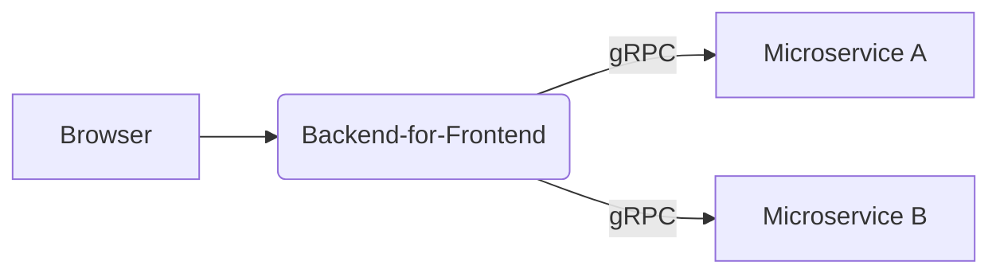
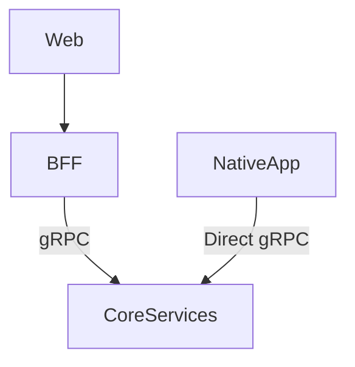

# Key Reasons to Use gRPC for Web Apps

## Backend-to-Backend Communication

- Your web app talks to a backend-for-frontend (BFF) service via REST/GraphQL
- The BFF then uses high-performance gRPC to communicate with other services
- Native mobile apps benefit from gRPC's efficiency
- Web interface uses traditional APIs that proxy to gRPC services



## Hybrid Architecture Benefits

| Component          | Protocol      | Benefits                          |
|--------------------|---------------|-----------------------------------|
| Web Frontend       | REST/GraphQL  | Browser compatibility             |
| Mobile Apps        | gRPC          | Performance, battery efficiency   |
| Service-to-Service | gRPC          | High throughput, strong contracts |

## Real-World Production Pattern

```javascript
// Backend-for-Frontend (Next.js API Route)
export default async function handler(req, res) {
  // 1. Receive HTTP request from browser
  const productId = req.query.id;
  
  // 2. Call gRPC service internally
  const product = await grpcClient.getProduct(productId);
  
  // 3. Return as JSON to browser
  res.json({
    id: product.id,
    name: product.name,
    price: product.price
  });
}
```



## Why Teams Choose This Architecture

Development Efficiency:

Single proto file defines contracts for:

- Web (via BFF)
- Mobile (direct gRPC)
- Services (direct gRPC)

Performance Metrics:

| Operation   | REST/JSON | gRPC           |
|-------------|-----------|----------------|
| Latency     | 150ms     | 50ms           |
| Throughput  | 1k RPS    | 10k RPS        |
| Data Size   | 100%      | 30–50%         |
