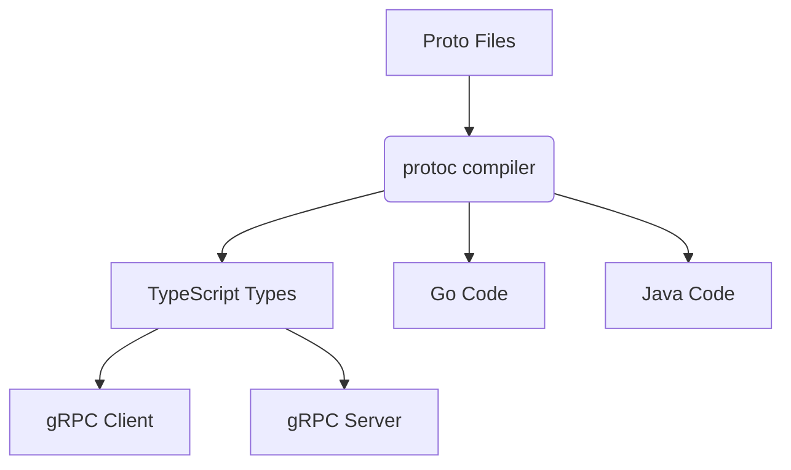

# What is gRPC?

gRPC is a modern, high-performance RPC (Remote Procedure Call) framework that enables client and server applications to communicate transparently.
It was developed by Google and is now part of the Cloud Native Computing Foundation (CNCF).

Key Characteristics:

- Language-neutral - Works across multiple programming languages
- Protocol Buffers - Uses binary serialization instead of JSON/XML
- HTTP/2 based - Enables advanced features like streaming
- Type-safe - Auto-generated client/server code from .proto files
- Efficient - 5-10x faster than REST+JSON in many cases

## Core Components

### Protocol Buffers (.proto files)

- Messages: Define your data structures
- Service Definition: Declares your RPC methods
- Fields: Numbered fields (important for backward compatibility)

Example Service Defination:

```typescript
syntax = "proto3";

service ProductService {
  rpc GetProduct (ProductRequest) returns (ProductResponse);
}

message ProductRequest {
  string id = 1;
}

message ProductResponse {
  string id = 1;
  string name = 2;
  float price = 3;
}
```

### gRPC Server

- Typically runs on HTTP/2
- Handles incoming RPC calls
- Implements the service interface
- Manages connections and threading

### gRPC Client

- Stub that calls server methods like local functions
- Generated from the .proto file
- Handles networking transparently

## Communication Patterns

### Unary RPC (Request-Response)

```typescript
// Client
const response = await client.getProduct({ id: "123" });

// Server
function getProduct(call, callback) {
  const product = db.find(call.request.id);
  callback(null, product);
}
```

### Server Streaming

```typescript
// Client
const stream = client.listenForUpdates({});
stream.on('data', (update) => {
  console.log(update);
});

// Server
function listenForUpdates(call) {
  setInterval(() => {
    call.write({ update: new Date().toISOString() });
  }, 1000);
}
```

### Client Streaming

```typescript
// Client
const stream = client.uploadData();
stream.write({ chunk: "part1" });
stream.write({ chunk: "part2" });
stream.end();

// Server
function uploadData(call, callback) {
  let data = "";
  call.on('data', (chunk) => {
    data += chunk;
  });
  call.on('end', () => {
    callback(null, { status: "OK" });
  });
}
```

### Bidirectional Streaming

```typescript
// Client
const stream = client.chat();
stream.write({ message: "Hi" });
stream.on('data', (response) => {
  console.log(response.message);
});

// Server
function chat(call) {
  call.on('data', (message) => {
    call.write({ message: `You said: ${message}` });
  });
}
```

### When to Use gRPC

✅ Low-latency systems
✅ Streaming applications
✅ Microservices communication
✅ Mobile clients talking to backend

### When not to use

❌ Simple CRUD apps where REST would suffice
❌ Public APIs where you can't control clients
❌ Browser-to-service communication (Web gRPC requires gRPC-Web)

## Production Considerations

Service Definition:

- Design your proto files carefully (they're your API contract)
- Use semantic versioning for your proto files
- Plan for backward compatibility

Performance:

- Keep connections alive
- Connection pooling is critical
- Consider load balancing strategies

Observability:

- Distributed tracing
- Implement interceptors for logging
- Export metrics (latency, error rates)

Security:

- Input validation
- Always use TLS in production
- Authentication (JWT, mTLS, etc.)

Training Needs:

- Protocol Buffers syntax
- Performance optimization
- Debugging tools (BloomRPC, gRPCurl)
- gRPC concepts (channels, stubs, streaming)



## Comparison with REST

| Feature          | gRPC              | REST/HTTP         |
|------------------|-------------------|-------------------|
| Protocol         | HTTP/2            | HTTP/1.1          |
| Payload          | Binary (Protobuf) | Text (JSON/XML)   |
| Streaming        | Yes               | Limited           |
| Code Generation  | Built-in          | OpenAPI/Swagger   |
| Browser Support  | Requires gRPC-Web | Native            |

## Example Production Checklist

- Proto files versioned and documented
- TLS configured for all connections
- Connection pooling implemented
- Metrics and logging set up
- Load testing performed
- Client libraries published
- Health checks implemented
- Deployment rollback plan

## Debugging Tips

- gRPCurl (like cURL for gRPC): ```grpcurl -plaintext localhost:50051 list```
- BloomRPC - GUI client for gRPC
- Logging Interceptors:

```javascript
const loggingInterceptor = (options, nextCall) => {
  return new grpc.InterceptingCall(nextCall(options), {
    start: (metadata, listener, next) => {
      console.log('Starting call with metadata:', metadata);
      next(metadata, listener);
    }
  });
};
```
